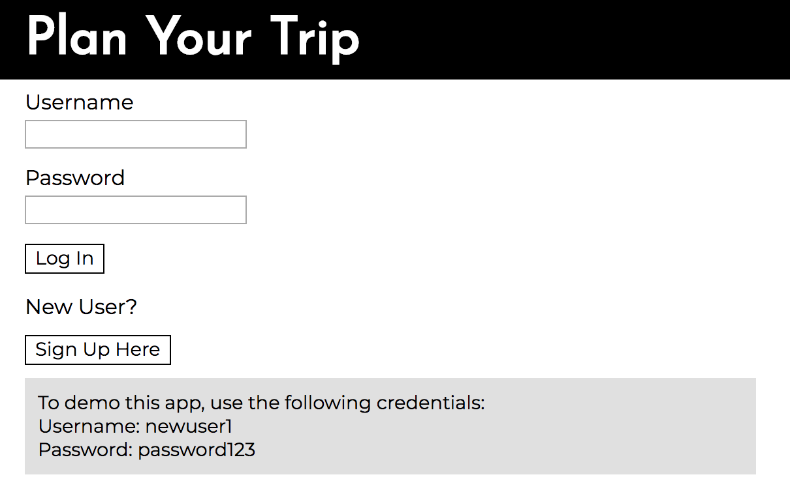
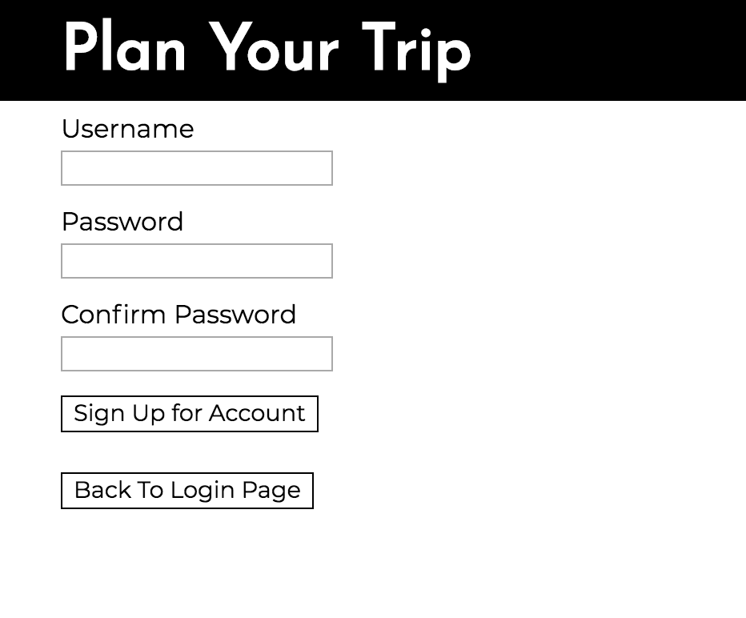
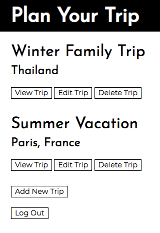
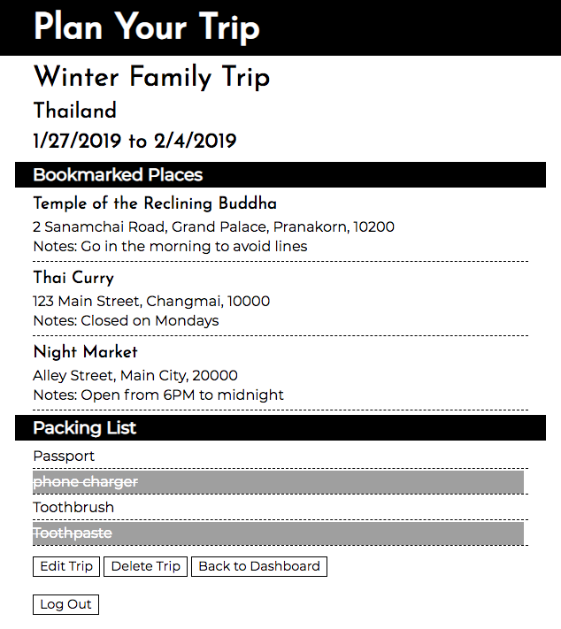
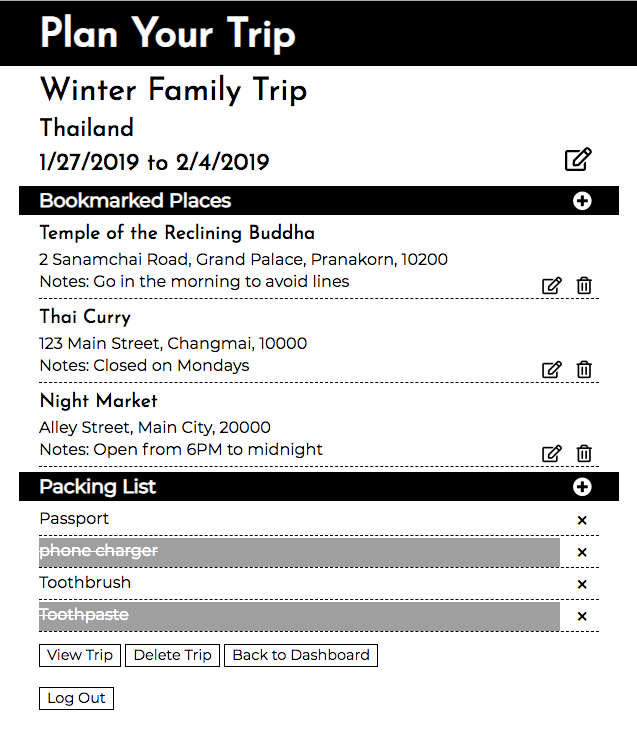

Getting too stressed out? Take a break and plan your upcoming trips.

Create a new account and get started: https://obscure-brook-80680.herokuapp.com/

## Screenshots

### Initial Login Page:
Login page with an option to sign up as a new user. Also has instructions to access a test account. 

---

### Signup Page:
Signup page to create an account. After an account is created successfully, the user will be logged in automatically. 

---

### Dashboard:
Example of a dashboard showing all trips that the user has created and options to view/edit/delete each trip.\

---

### View Page:
View the details of a particular trip including location(s), dates, bookmarked places, and packing list. In this mode, the user can still check/uncheck items on the packing list.\

---

### Edit Page:
Edit/add/delete options for a specific trip.\

## Summary

Plan Your Trip seeks to provide a centralized location for users to collect and organize information to help them prepare for their upcoming trips.

Built with: HTML, CSS, Javascript, jQuery, Node.js, Express, Passport, Mongoose, MongoDB

## Goals for Future Versions

Integration with Google Calendar so that the user can build a travel itinerary on google calendar within the app

Embedding results from my Gotta Jet app to provide place suggestions & display weather/packing item suggestions
